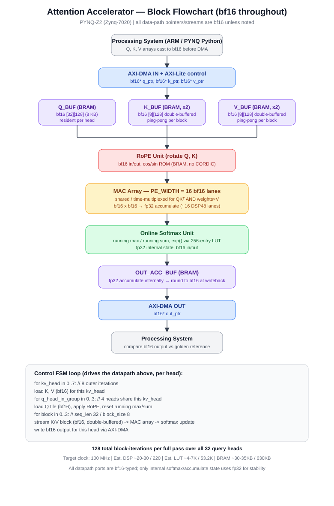
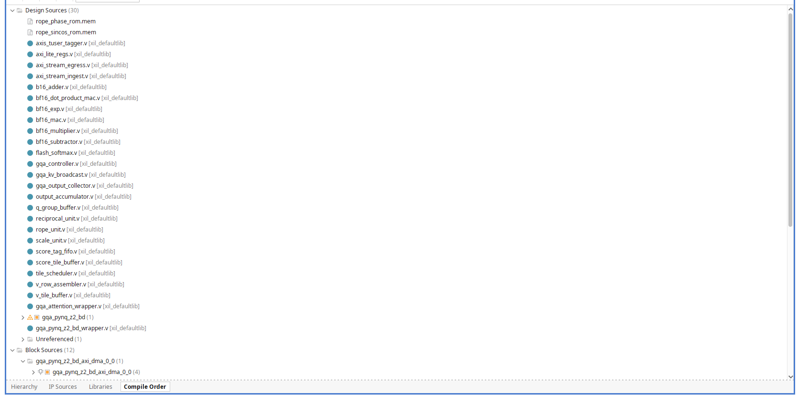

# Llama-3 GQA Attention RTL Accelerator

[](https://pradeep05-m.github.io/attention_accelerator/)

> 🌐 **Interactive Engineering Portfolio**: [https://pradeep05-m.github.io/attention_accelerator/](https://pradeep05-m.github.io/attention_accelerator/)



This is a BF16 GQA attention core targeting the Llama-3 8B geometry: 32 Q
heads, 8 KV heads, group size 4, and head dimension 128. Its default RTL
configuration uses a 256-bit AXI4-Stream ingress/egress. The fit-oriented
PYNQ-Z2 block-design configuration uses a 64-bit stream. BF16 is implemented
in LUT/DSP logic; the Zynq-7020 has no native BF16 DSP mode.


For PYNQ-Z2 synthesis the block design configures `GROUP_SIZE=1`. This
time-multiplexes the four Q heads belonging to each KV head through one
compute lane, preserving the 32:8 GQA mapping while making the XC7Z020 a
realistic target. The weighted-V engine is additionally configured with
`ACC_TILE_DIM=1`, `TILE_DIM=4`, and `KV_BLOCK_LEN=4`, with a matching 64-bit DMA stream. This
reuses one internal BF16 lane over the 128 output elements and uses four MAC
lanes per stream beat instead of the default sixteen. It is intentionally
latency-heavy, but preserves the arithmetic and output data while fitting the
XC7Z020 more comfortably. A `GROUP_SIZE=4` override remains available for
simulation/throughput experiments but exceeds the board's LUT and flip-flop
capacity.

## Stream contract

In the default RTL configuration, `s_axis_tdata` is one 16-element BF16 vector
(256 bits). `TUSER` selects `00=Q`, `01=K`, `10=V`. A Q row is eight beats; a
K/V position is eight K beats followed by eight V beats. The PYNQ-Z2 block
design instead uses four elements per 64-bit beat, so each corresponding row
uses 32 beats. Provide Q rows in logical-head order; the core time-multiplexes
the four logical Q heads that share each KV head.
Provide K/V in increasing cache-position order for the active KV head. The
final KV block must be padded to 4 entries; production software must use a
score mask for those pad entries (not implemented in this baseline yet).

The output is eight 256-bit AXI-stream beats per Q-head result. `TLAST` marks
the final beat of each 128-element output row. `axi_stream_egress` is the
instantiated output block; it holds `TDATA` and `TLAST` stable during `TREADY`
backpressure.

## Control registers

Besides the existing register map, write `QUERY_POSITION` at `0x28` before
`START`. This is the absolute RoPE position for the four input Q heads.
`N_KV_TILES` must be exactly `ceil(sequence_length / KV_BLOCK_LEN)`; the
PYNQ-Z2 build uses `KV_BLOCK_LEN=4`, while the default RTL simulation remains
at 16. A mismatched start command is rejected.
Padding and causal masking are implemented in hardware. A K/V position is
valid only when `key_position < SEQ_LEN` and `key_position <= QUERY_POSITION`;
masked values contribute zero probability and zero weighted-V contribution.

## RoPE assets

Generate the required original Llama-3 coefficients with:

```sh
python3 tools/gen_rope_rom.py --out-dir rope_rom
```

The generated files use `rope_theta=500000`, head dimension 128, and Llama's
`rotate_half` pairing. Add `rope_rom/*.mem` to the Vivado simulation and
implementation sources.

The generator is now included in `tools/gen_rope_rom.py`; it rounds ROM
entries to BF16 using round-to-nearest-even and creates the exact filenames
loaded by `rope_unit.v`. The PYNQ synthesis Tcl checks that both files exist
before starting synthesis.

## Verification

### Self-checking GQA wrapper simulation (Vivado)

First generate the input vectors and golden reference output:

```sh
python3 pyfiles/gen_gqa_wrapper_vectors.py --out-dir tests/data
```

Then run the complete AXI-Lite/AXI-Stream wrapper testbench:

```sh
vivado -mode batch -source scripts/run_gqa_wrapper_sim.tcl
```

The first invocation creates `build/gqa_wrapper_sim`; later invocations reuse
that project so XSim can compile incrementally.  The FSM and handshake trace
is off by default to keep normal regressions fast. Enable it in batch mode
with `TRACE=1 vivado -mode batch -source scripts/run_gqa_wrapper_sim.tcl`.

The testbench loads `gqa_golden.mem`, compares each received BF16 output
element, and reports `PASS` or ends simulation with `FAIL`.  The default
allows 64 BF16 ULPs per element; set testbench parameter `MAX_ULP` to zero
when your reference is bit-exact.  The captured RTL rows are written to
`build/gqa_wrapper_sim/gqa_rtl_out.mem`.

For the Vivado GUI, create an RTL project, add the RTL files listed in
`scripts/gqa_sources.tcl` as Design Sources, add
`tests/tb_gqa_attention_wrapper.sv` as a Simulation Source, set
`tb_gqa_attention_wrapper_v2` as the simulation top, and choose **Run Simulation → Run Behavioral
Simulation**. Add the four `tests/data/gqa_*.mem` files as simulation sources
before launching.  The batch script above is the easier and reproducible
option.

Run the smoke test:

```sh
iverilog -g2012 -s tb_axi_stream_egress -o /tmp/tb_axis \
  axi_stream_egress.v tests/tb_axi_stream_egress.v
vvp /tmp/tb_axis

iverilog -g2012 -s tb_score_tile_mask -o /tmp/tb_mask \
  score_tile_buffer.v tests/tb_score_tile_mask.v
vvp /tmp/tb_mask

iverilog -g2012 -s tb_flash_softmax_mask -o /tmp/tb_softmax \
  b16_adder.v bf16_exp.v bf16_multiplier.v bf16_subtractor.v \
  reciprocal_unit.v flash_softmax.v tests/tb_flash_softmax_mask.v
vvp /tmp/tb_softmax
```

### 65k-vector randomized accuracy regression

The default generator is deliberately a small deterministic smoke test.  For
accuracy work, generate a randomized 65,536-element BF16 input corpus and run
the same self-checking wrapper simulation:

```sh
python3 pyfiles/gen_gqa_wrapper_vectors.py --out-dir tests/data \
  --mode random --seed 20260805 --target-input-vectors 65536
vivado -mode batch -source scripts/run_gqa_wrapper_sim.tcl
```

With the default 32-Q-head, 8-KV-head, 128-wide geometry, 65,536 valid input
elements corresponds exactly to `SEQ_LEN=30`: 4,096 Q elements plus 61,440 K/V
elements.  The final 16-wide hardware block requires two zero K/V padding rows,
which are masked by the RTL; the actual AXI transport therefore contains 69,632
elements. The generator records both counts in `gqa_config.txt`, and the Vivado
script automatically elaborates the testbench for that sequence length. Use a
different seed for each independent corpus; keep the seed in the result log so
any accuracy failure is reproducible.

### Boundary and protocol regression

Run the complete wrapper regression suite with:

```sh
python3 pyfiles/run_gqa_regression.py
```

It covers sequence lengths 1, 15, 16, 17, 30, and 32. The 17- and 32-token
random cases apply deterministic output backpressure, and a final test verifies
that the wrapper rejects an unsupported runtime configuration. Case-specific
vectors and simulator logs are retained under `build/gqa_regression/`. Use
`--generate-only` to create and inspect every corpus without running Vivado.

### BF16 primitive conformance

Before interpreting a wrapper-level accuracy failure, run the 65,536-case
BF16 arithmetic regression:

```sh
python3 pyfiles/gen_bf16_primitive_vectors.py --out-dir tests/data/bf16_primitives
iverilog -g2012 -s tb_bf16_primitives -o /tmp/tb_bf16 \
  b16_adder.v bf16_multiplier.v tests/tb_bf16_primitives.sv
vvp /tmp/tb_bf16 +MEM_DIR=tests/data/bf16_primitives
```

## PYNQ-Z2 synthesis



Use Vivado 2020.2-compatible tooling (the PYNQ-Z2's Zynq-7020 target is
`xc7z020clg400-1`) to run:

```sh
vivado -mode batch -source scripts/synth_pynq_z2.tcl
```

It emits `build/pynq_z2_synth/utilization.rpt` and `timing_summary.rpt`.
Do not create a bitstream until utilization is within the Zynq-7020 limits.
The script creates a PS7 + AXI DMA block design, so the accelerator's wide
AXI interfaces are fabric nets rather than top-level package I/O.  AXI GPIO
drives the input packet plane tag: software must write `0`, `1`, or `2`
(`Q`, `K`, or `V`) before submitting the matching MM2S DMA packet.

Before board use, add a PyTorch golden test for RoPE + attention and test
sequence lengths 1, 16, 17, 128, and 2048.

## Current Project Status & Architecture Summary

### Implemented Features
- **GQA Architecture**: Configured for Llama-3 8B geometry (32 Q heads, 8 KV heads, Group Size 4, Head Dim 128).
- **Precision**: Full BF16 arithmetic implemented in LUT/DSP logic (Custom adders, multipliers, subtractors, exps, and reciprocal units).
- **Attention Pipeline**:
  - RoPE (Rotary Position Embedding) transformation unit with ROM precomputed coefficients (`rope_theta=500000`).
  - Score tile buffering, causal & padding masking.
  - Hardware Flash Softmax engine for online softmax computation.
  - Weighted-V accumulation & output collection.
- **Interfaces**:
  - AXI4-Lite control register interface (`axi_lite_regs.v`).
  - AXI4-Stream ingress and egress adapters (`axi_stream_ingest.v`, `axi_stream_egress.v`).
- **PYNQ-Z2 Target Support**:
  - Resource-fit configuration (`GROUP_SIZE=1`, 64-bit AXI-Stream, time-multiplexed compute lane).
  - Synthesis scripts (`synth_pynq_z2.tcl`) targeting Xilinx XC7Z020 FPGA.

### Verification & Test Suite
- Comprehensive Verilog / SystemVerilog testbenches.
- Python verification scripts for test vector generation (`gen_gqa_wrapper_vectors.py`, `gen_bf16_primitive_vectors.py`).
- Automated multi-token boundary and protocol regression suite (`run_gqa_regression.py`).

